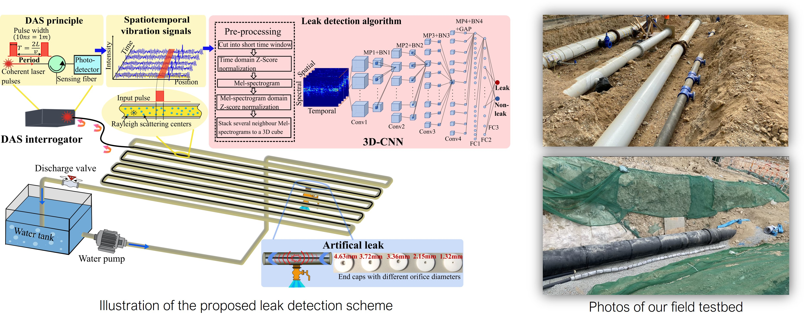

Over the past years, we have established collaborations with various research teams and industry partners to implement our DOFS systems across multiple fields.

#### 1. Leveraging Optical Communication Fiber and AI for Distributed Water Pipe Leak Detection
Detecting leaks in water networks is a costly challenge. We collaborated with the Hydraulics research group at PolyU and introduced a solution - the integration of an optical network that uses  fiber-optic cable measure vibrations, enabling accurate leak detection and localization by an intelligent algorithm. We also propose a method to assess leak severity for prioritized repairs. Our solution is capable of detecting even small leaks with a flow rate as low as 0.027 L/s, offering a cost-effective way to improve leak detection, enhance water management, and optimize operational efficiency.

Further research with large-scale experiments will be conducted at Q-Leak underground water mains leak detection training center and Anderson Road Quarry Site in Hong Kong to explore the challenges and opportunities of integrating optical networks and water distribution networks (WDNs).

Related Project: Consultancy study on distributed fiber optic system for leak detection for water mains in Anderson Road Quarry Development Site

#### 2. Novel Mining Conveyor Monitoring System based on Quasi-Distributed Optical Fiber Accelerometer Array and Self-supervised Learning 

