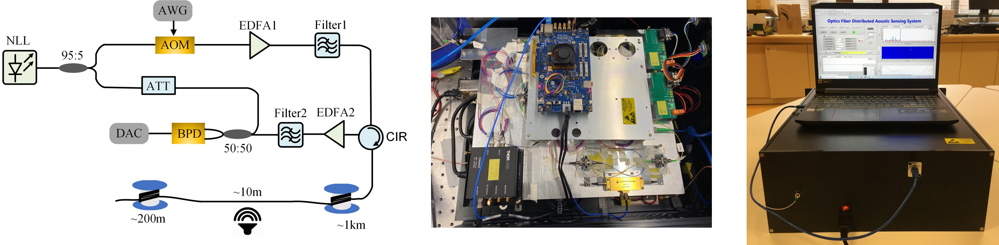
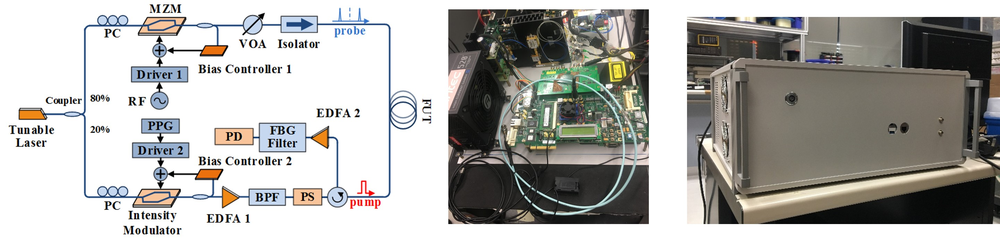
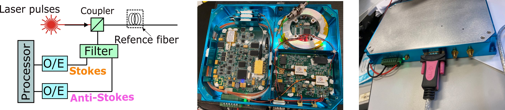

My research focuses on the field of distributed optical fiber sensors (DOFSs) and their applications. I am interested in developing new optical fiber-based monitoring technologies. The development of new DOFSs involves a combination of advanced interrogation schemes (modulation and demodulation parts), utilizing specialty optical fibers, and designing transducers.
Moreover, I am actively engaged in exploring data-driven signal processing methods to effectively leverage the data collected from fiber-optic-based sensors. My overarching goal is to make meaningful advancements in this area and harness the full potential of light and optical fiber, thereby creating intelligent and superior sensing solutions.

### <ins>Distributed optical fiber sensing technologies</ins>     
In my research, I have focused on exploring the following three distributed optical fiber sensors.

#### 1. Distributed acoustic sensor (DAS)
The working principle of DAS is based on the phase-sensitive OTDR that utilizes the interference effect of Rayleigh backscattering of different scatters within the pulse width. A DAS prototype that can realize real-time vibration sensing along 30 km optical fiber was built in our lab. Check out the basic principle of DAS [here] ()

  
#### 2. Distributed temperature and strain sensing (DTSS)     
The working principle of DTSS is based on the stimulated Brillouin scattering that utilizes the linear relationship of Brillouin frequency shift and temperature/strain. A DTSS system that can realize temperature/strain sensing along 50 km optical fiber was built in our lab.Check out the basic principle of DTSS [here] ()

  
#### 3. Distributed temperature sensing (DTS)     
The working principle of DTS is based on Raman scattering, which utilizes the relationship between Stokes and anti-Stokes intensities and temperature. In our lab, we have built a DTS system capable of realizing temperature sensing along a 10 km optical fiber in our lab. Check out the basic principle of DTS [here] ()

  
### <ins>Talks <ins>
"Harnessing the power of light: the journey of distributed optical fiber sensors," Chongqing University summer visit to PolyU, July 2023.      

“Optical fiber sensing applications in real-time assets health monitoring for building structures,” Webinar on Application of Automation and Technology in Construction Materials Testing, Hong Kong Council for Testing and Certification, Feb 2023.

  
### <ins>Professional Services <ins>

**Consultant** for Water Supplies Department, The Government of Hong Kong SAR     
Project: Consultancy study on distributed fiber optic system for leak detection for water mains in Anderson Road Quarry Development Site, ongoing

**Reviewer** for Optics Express, Photonics Journal, Journal of Lightwave Technology, Optics and Lasers in Engineering

  
### <ins>Publications <ins>
1. __H. Wu__, H. F. Duan, Wallace Lai, K. Zhu, X. Cheng, H. Yin, B. Zhou, C. C. Lai, C. Lu, and X. L. Ding. “Leveraging optical communication fiber and AI for distributed water pipe leak detection,” IEEE Communications Magazine, to appear.  <a href="https://haleywuhuan.github.io/profile/assets/paper1.pdf" target="_blank"> full paper</a>

2. H. Zheng, __H. Wu*__, C. Y. Leong, Y. Y. Wang, X. L. Shen, Z. Fang, X. Chen, J. X. Cui, D. J. Ma, Y. Miao, L. Zhou, M. Yan, J. Sun, H. Y. Tam, X. L. Ding, C. Lu. “Enhanced quasi-distributed accelerometer array based on phase-OTDR and ultraweak fiber Bragg grating,” IEEE Sensors Journal, early access, 2023.<a href="https://haleywuhuan.github.io/profile/assets/paper2.pdf" target="_blank"> full paper</a>

3. H. Zheng+, __H. Wu+*__, D. J. Ma, Y. Miao, L. Zhou, M. Yan, J. Sun, C. Y. Yu, X. L. Ding, C. Lu. “Novel mining conveyor monitoring system based on quasi-distributed optical fiber accelerometer array and self-supervised learning,” Under review.

4. Y. Y. Wang, H. Zheng, __H. Wu__, D. M. Huang, C. Y. Yu, and C. Lu. “Coherent OTDR with large dynamic range based on double-sideband linear frequency modulation pulse,” Optics Express, 31(11), 17165-17174, 2023.<a href="https://haleywuhuan.github.io/profile/assets/paper4.pdf" target="_blank"> full paper</a>

5. __H. Wu__, B. Zhou, K. Zhu, C. Shang, H.Y. Tam, and C. Lu. “Pattern recognition in distributed fiber-optic acoustic sensor using an intensity and phase stacked convolutional neural network with data augmentation,” Optics Express, 29(3), 3269-3283, 2021.<a href="https://haleywuhuan.github.io/profile/assets/paper5.pdf" target="_blank"> full paper</a>

6. Z. Y. Zhao+, __H. Wu+__, J. H. Hu, K. Zhu, Y. L. Dang, Y. X. Yan, M. Tang, and C. Lu. “Interference fading suppression in phase-OTDR using space-division multiplexed probes,” Optics Express, 29(10), 15452-15462, 2021.<a href="https://haleywuhuan.github.io/profile/assets/paper6.pdf" target="_blank"> full paper</a>

7. K. Zhu, B. Zhou, __H. Wu*__, C. Shang, L. Y. Lu, M. Adeel, Y. Y. Xi, Z. Y. Zhao, H. Y. Tam and C. Lu. “Multipath distributed acoustic sensing system based on phase-sensitive optical time-domain reflectometry with frequency division multiplexing technique,” Optics and Lasers in Engineering, 142, 106593, 2021.<a href="https://haleywuhuan.github.io/profile/assets/paper7.pdf" target="_blank"> full paper</a>

8. __H. Wu__, C. Shang, K. Zhu, and C. Lu, “Vibration detection in distributed acoustic sensor with threshold-based technique: a statistical view and analysis,” Journal of Lightwave Technology, 39(12), 4082-4093, 2020.<a href="https://haleywuhuan.github.io/profile/assets/paper8.pdf" target="_blank"> full paper</a>,<a href="https://github.com/haleywuhuan/Distributed-Acoustic-Sensor-DAS1K-Pattern-Recognition" target="_blank"> project page</a>

9. M. Adeel, C. Shang, D. Hu, __H. Wu__, K. Zhu, A. Raza, C. Lu, ‘Impact-based feature extraction utilizing differential signals of phase-sensitive OTDR,’ Journal of Lightwave Technology, 38(8), 2539-2546, 2020.<a href="https://haleywuhuan.github.io/profile/assets/paper9.pdf" target="_blank"> full paper</a>

10. __H. Wu+__, H. D. Wang+, C. Shu, C. S. Choy, and C. Lu, “BOTDA fiber sensor system based on FPGA accelerated support vector regression,” IEEE Transactions on Instrumentation and Measurement, 69(6), 3826-3837, 2019.<a href="https://haleywuhuan.github.io/profile/assets/paper10.pdf" target="_blank"> full paper</a>

11. __H. Wu__, L. Wang, Z. Zhao, C. Shu, C. Lu, “Support vector machine based differential pulse-width pair Brillouin optical time domain analyzer,” IEEE Photonics Journal, 10(4),1-11, 2018.<a href="https://haleywuhuan.github.io/profile/assets/paper11.pdf" target="_blank"> full paper</a>

12. __H. Wu__, L. Wang, Z. Zhao, N. Guo, C. Shu, C. Lu, ‘Brillouin optical time domain analyzer sensors assisted by advanced image denoising techniques,’ Optics Express, 26(5), 5126-5139, 2018.<a href="https://haleywuhuan.github.io/profile/assets/paper12.pdf" target="_blank"> full paper</a>

13. __H. Wu__, L. Wang, N. Guo, C. Shu, C. Lu, ‘Support vector machine assisted BOTDA utilizing combined Brillouin gain and phase information for enhanced sensing accuracy,’ Optics Express, 25(25), 31210-31220, 2017.<a href="https://haleywuhuan.github.io/profile/assets/paper13.pdf" target="_blank"> full paper</a>

14. N. Guo, L. Wang, __H. Wu__, C. Jin, H. Y. Tam, C. Lu, ‘Enhanced coherent BOTDA system without trace averaging,’ Journal of Lightwave Technology, 36(4), 871-878, 2017.<a href="https://haleywuhuan.github.io/profile/assets/paper14.pdf" target="_blank"> full paper</a>

15. __H. Wu__, L. Wang, N. Guo, C. Shu, C. Lu, ‘Brillouin optical time-domain analyzer assisted by support vector machine for ultrafast temperature extraction,’ Journal of Lightwave Technology, 35(19), 4159-4167, 2017.<a href="https://haleywuhuan.github.io/profile/assets/paper15.pdf" target="_blank"> full paper</a>

"+" represents the equal contribution     
"*" represents the corresponding author
