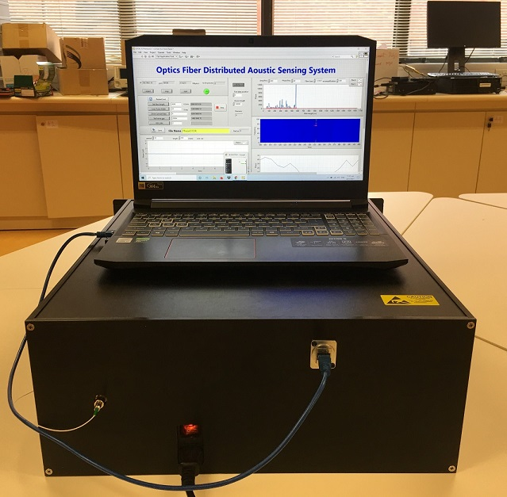
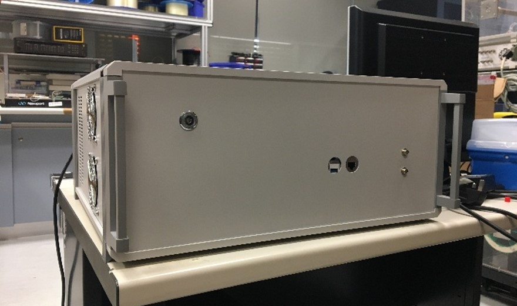

My research focuses on the field of distributed optical fiber sensors and their applications. I am interested in developing new optical fiber-based monitoring technologies that enable gaining insights into monitoring infrasture, detecting anomalies, and providing sensing data for performance analyses. Additionally, I am conducting research on data-driven signal processing methods to effectively utilize the data collected from fiber-optic-based sensors. Throughout my work, I aim to make meaningful advancements in this area and harness the full potential of light and optical fiber to create smarter and better sensing solutions for industy. 

### <ins>Distributed optical fiber sensing technologies</ins>
Distributed optical fiber sensors allow many points to be measured simultaneously, and it is compatible to ubiquitously deployed underground fiber system for telecommunication purpose.
#### 1. Distributed acoustic sensor (DAS)
The working principle of DAS is based on the phase-sensitive OTDR that utilizes the interference effect of Rayleigh backscattering of different scatters within the pulse width. A DAS prototype that can realize real-time vibration sensing along 30 km optical fiber was built in our lab. Check out the basic principle of DAS [here] ()

  
#### 2. Distributed temperature and strain sensing (DTSS)
The working principle of DTSS is based on the stimulated Brillouin scattering that utilizes the linear relationship of Brillouin frequency shift and temperature/strain. A DTSS system that can realize temperature/strain sensing along 50 km optical fiber was built in our lab.Check out the basic principle of DTSS [here] ()

  
#### 3. Distributed temperature sensing (DTS)
The working principle of DTSS is based on the stimulated Brillouin scattering that utilizes the linear relationship of Brillouin frequency shift and temperature/strain. A DTSS system that can realize temperature/strain sensing along 50 km optical fiber was built in our lab.Check out the basic principle of DTS [here] ()

